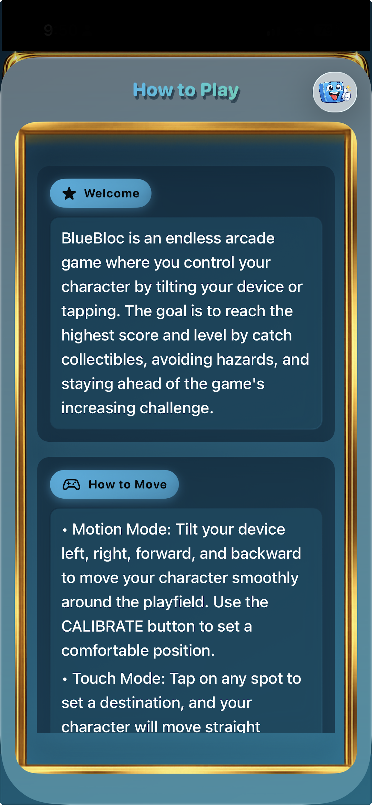
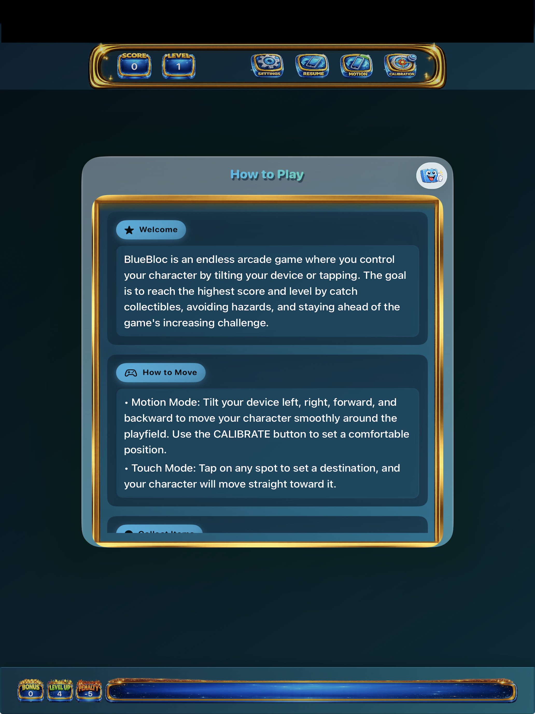

# BlueBloc Support

BlueBloc is an arcade survival game where the player controls a blue block using motion or touch input, collects items, avoids hazards, and tries to reach the highest possible score and level.

This page is intended to serve as the public support home for the app.

## Contact

For support, bug reports, or App Store questions, contact:

- Email: `sean.lou20@gmail.com`

When contacting support, include:

- Your device model
- Your iOS or iPadOS version
- The app version
- A short description of the issue
- Steps to reproduce the issue
- Screenshots or screen recordings, if available

## Quick Help

### How do I move?

- Motion Mode: Tilt your device to move.
- Touch Mode: Tap a destination on the playfield and the character moves toward it.
- If motion feels inaccurate, use the in-app `CALIBRATE` button.

### How do I score?

- Regular collectibles add points and grow the player.
- If a level contains only one collectible, it becomes a higher-value bonus collectible.
- Hitting hazards removes points and shrinks the player.
- If your score drops below zero, the run ends.

### What happens in Demo Mode?

- Demo Mode runs an automated session so you can watch the gameplay.
- Demo Mode is intended as a preview and learning aid, not as normal gameplay.

### Why do I see ads?

- BlueBloc uses Google AdMob to display ads, including interstitial and rewarded ads.
- Rewarded ads may be used to unlock bonuses or continues.

## Troubleshooting

### Motion controls do not feel right

- Hold the device comfortably and tap `CALIBRATE`.
- Make sure device rotation is not changing unexpectedly while you play.
- If needed, switch to Touch Mode in the app.

### The game feels paused or not responding

- Tap the pause/resume control in the top bar.
- If an overlay or modal is open, close it first.
- Restart the app if the session appears stuck.

### Ads are not loading

- Check your network connection.
- Ad availability may vary by region, inventory, and eligibility.
- If a rewarded ad is unavailable, try again later.

## Privacy

BlueBloc stores certain gameplay preferences and progression-related values locally on the device, such as control mode, audio preferences, best score, best level, and other gameplay settings.

BlueBloc also uses Google AdMob to serve ads. Depending on platform behavior, consent status, and ad availability, Google and its partners may process device and advertising-related data according to their own policies.

See the full privacy policy here:

- [Privacy Policy](PrivacyPolicy.md)

## Screenshots

### iPhone

  
  
  

### iPad

  
  
  

